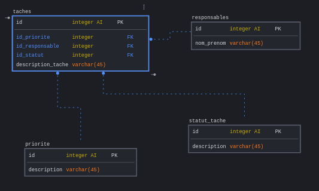
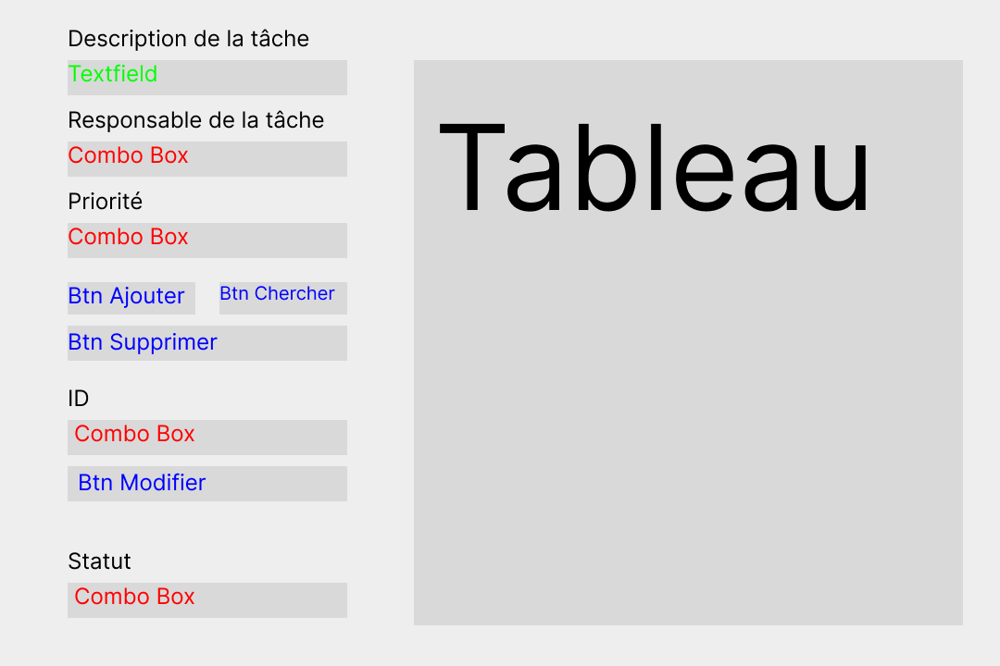

# CORAL Hugo, DUCHATEL Antoine, DUTILLEUL Quentin
# Compte-rendu Mission 7

---

# Contexte

La mission 7 consistait en la réalisation d'une application permettant de gérer une liste de tâches dans la clinique. Les employés doivent pouvoir:

- Ajouter une tâche

- Supprimer une tâche

- Modifier une tâche

- Connaître l'état d'une tâche (En cours, en attente, ou terminée)

---

# I. La base de données

Notre base de données est composée de 3 tables:

- **taches**: Base principale qui stocke les tâches ainsi que leurs données associées telles que sa priorité, son responsable, son statut et sa description.

- **priorite**: Contient tous les types de priorité possibles pour une tâche.

- **responsables**: Liste toutes les personnes pouvant être tenues comme responsables d'une tâche.

- **statut_tache**: Possède tous les types de statut de tâche possibles pour une tâche.

---

# II. L'application

L'application sera réalisée en Java en GUI (Graphical User Interface) avec l'API Java Swing. 

## 1. La maquette

Avant de réaliser l'application, il faut réaliser une maquette. Cela est essentiel afin de confectionner l'**interface utilisateur**. 

Voici la maquette:

## 2. Fonctionnement de l'application

![Capture d'écran de l'application Java finie][app.png]

Cette application permet donc d'ajouter une tâche, de les modifier voire de les supprimer.

- Le textfield ``description de la tâche`` permet de rentrer la description de la tâche à ajouter à la base de données.

- La ComboBox ``Responsable de la tâche`` sert à définir le responsable de la tâche.

- La ComboBox ``Priorité`` a pour utilité de définir la priorité de la tâche.

- La Combobox ``ID`` permet de choisir l'ID de la tâche à modifier

- La ComboBox ``Statut`` permet elle de modifier le statut de la tâche choisie par l'ID.